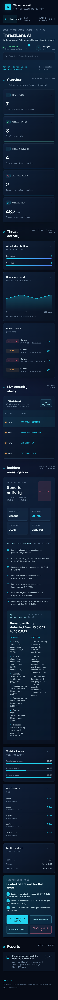

# ThreatLens AI

**Evidence-Aware Autonomous Network Security Analyst**

**Detect. Investigate. Explain. Respond.**

## 1. Problem

Security teams receive large volumes of network telemetry but need to quickly
separate normal traffic from suspicious activity, understand why an event was
flagged, and decide what to do next. Raw model scores alone are not enough for
an analyst-ready incident workflow.

## 2. Solution

ThreatLens AI combines the existing network threat ML pipeline with a FastAPI
integration layer, an evidence-aware investigation agent, and a React SOC
dashboard. The ML pipeline detects and scores the traffic. The agent retrieves
stored evidence and explains the event without changing the model result.

## 3. Architecture

```text
Network flow
    -> FastAPI /api/predict
    -> src.predictor.predict_threat()
    -> standardized Security Event
    -> in-memory event and traffic store
    -> Investigation Agent tools
    -> /api/investigate incident report
    -> React SOC dashboard
```

The MVP uses one backend service and one in-memory store. No microservices,
Docker, authentication, or separate database are required for the demo.

## 4. Tech Stack

- Python 3.12
- FastAPI and Uvicorn
- Pydantic
- React and Vite
- scikit-learn serialized model artifacts
- pandas, NumPy, and joblib
- CSS dashboard styling

## 5. ML Pipeline

The existing Member 1 pipeline is consumed through one public interface:

```python
from src.predictor import predict_threat
result = predict_threat(flow)
```

It performs:

- UNSW-NB15 feature preprocessing
- Normal versus suspicious classification
- Isolation Forest anomaly detection
- Attack-family classification
- Deterministic risk scoring from `src/risk_engine.py`
- Predictor-provided feature explanation

The backend does not duplicate preprocessing, classification, anomaly detection,
or risk calculation.

## 6. Agent Workflow

The lightweight agent lives in `backend/investigation_agent.py`.

Its tools retrieve real application data:

- `get_alert(event_id)` retrieves the stored Security Event.
- `get_traffic_details(event_id)` retrieves the submitted raw flow.
- `get_ip_history(source_ip)` retrieves prior registered events for that source.
- `get_attack_evidence(event_id)` formats classifier and anomaly outputs.
- `get_shap_explanation(event_id)` returns predictor-provided top features.
- `calculate_risk(event_id)` returns the risk and severity already produced by
  the ML pipeline.

The agent produces a structured incident report containing summary, attack type,
risk, severity, confidence, evidence, reasoning, and recommended actions. It
does not invent IP history, traffic statistics, model scores, feature values, or
risk scores. Missing evidence is explicitly reported as unavailable.

## 7. Key Features

- Premium dark navy/cyan SOC dashboard with responsive command-center layout
- Live dashboard overview populated from `/api/dashboard/stats`
- Suspicious alert table populated from `/api/alerts`
- Severity indicators for LOW, MEDIUM, HIGH, and CRITICAL
- Attack type, risk, and recent threat analytics
- Searchable live alert queue with event IDs, IPs, attack types, risk, and status
- Click-through incident investigation workspace
- Real model evidence and top contributing features
- AI investigation summary and reasoning
- Model evidence meters for suspicious, anomaly, and attack probabilities
- System health indicators for ML models, agent system, and database
- Reviewed, create-incident, and simulated-block actions
- Simulated block action never changes firewall or network configuration
- Visible loading, empty, unavailable, and API error states
- Responsive SOC layout for desktop and mobile screens

## Screenshots

### SOC overview

The overview combines live KPIs, attack distribution, risk trend, recent alerts,
and the operational alert queue in one dense SOC workspace.


### Evidence-aware investigation

Selecting an alert opens the real investigation agent output, including model
evidence, top contributing features, reasoning, traffic context, and controlled
response actions.



## 8. How to Run

From the repository root:

```powershell
pip install -r requirements.txt
python -m uvicorn backend.main:app --reload --host 127.0.0.1 --port 8000
```

In a second terminal:

```powershell
cd frontend
npm install
npm run dev -- --port 5174
```

Open:

```text
http://127.0.0.1:5174/
```

Swagger API documentation is available at:

```text
http://127.0.0.1:8000/docs
```

## 9. Demo Workflow

1. Open the dashboard and confirm `LIVE TELEMETRY`.
2. Click `Load model event` to send the real demo flow through the ML model.
3. Confirm the event appears in the alert table with attack type, risk, and severity.
4. Select the alert or click `View`.
5. Click `Investigate with AI`.
6. Show the actual suspicious probability, anomaly score, attack probability,
   top features, evidence, agent reasoning, and recommended response.
7. Demonstrate `Mark reviewed` and `Create incident` as local UI actions.
8. Demonstrate `Simulate block IP`; it only displays a confirmation and performs
   no firewall action.

If the API is unavailable, the dashboard keeps the layout available but shows
explicit unavailable/error states instead of inventing metrics or alerts.

## 10. Future Improvements

- Replace the in-memory event store with SQLite or a managed persistence layer.
- Align the serialized model and local scikit-learn versions to remove load warnings.
- Add real event streaming and time-windowed trend storage.
- Add analyst authentication and role-based access control.
- Connect approved response actions to a controlled orchestration system.
- Calibrate the model on live organizational traffic before production use.

## API Summary

- `GET /api/health`
- `POST /api/predict`
- `POST /api/investigate`
- `GET /api/alerts`
- `GET /api/alerts/{event_id}`
- `GET /api/dashboard/stats`
- `GET /api/sample`

## Demo Limitations

The event and agent stores are in memory and reset when FastAPI restarts. The
serialized model files emit scikit-learn version compatibility warnings in the
current local environment, but the tested inference path completes successfully.
The project is a hackathon MVP based on UNSW-NB15 telemetry and is not a claim
of production-ready perimeter protection.
